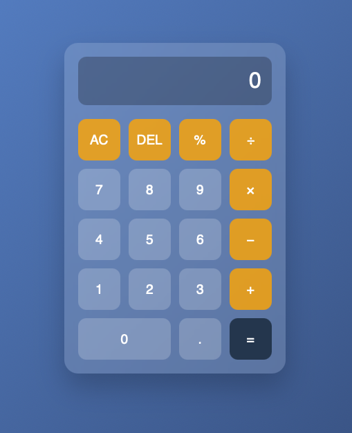

# 📱 Calculator App

A modern, responsive calculator built using **HTML, CSS, and JavaScript**.
It features a clean UI, smooth interactions, and full **keyboard support** for an enhanced user experience.

---

## ✨ Features

* 🧮 Basic arithmetic operations

  * Addition (`+`)
  * Subtraction (`−`)
  * Multiplication (`×`)
  * Division (`÷`)
  * Modulo (`%`)
* ⌨️ Keyboard input support
* 🖱️ Mouse / button input support
* 🎨 Modern glassmorphism-inspired UI
* 📱 Responsive design
* ❌ Invalid inputs are ignored automatically
* 🧹 Clear (`AC`) and delete (`DEL`) functionality

---

## 📸 Screenshot

## 🚀 Live Demo

https://yousefalhadha.github.io/Calculator/

---

## 🛠️ Built With

* **HTML5** – Structure
* **CSS3** – Styling & layout
* **JavaScript (ES6)** – Logic & interactivity

---

## ⌨️ Keyboard Controls

| Key           | Action            |
| ------------- | ----------------- |
| `0–9`         | Numbers           |
| `.`           | Decimal           |
| `+ - * / %`   | Operators         |
| `Enter` / `=` | Calculate result  |
| `Backspace`   | Delete last input |
| `Escape`      | Clear all         |

---

